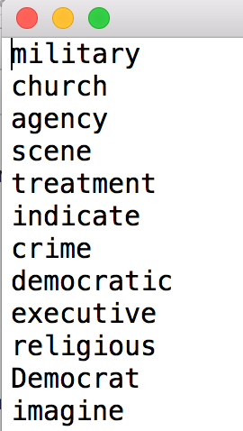
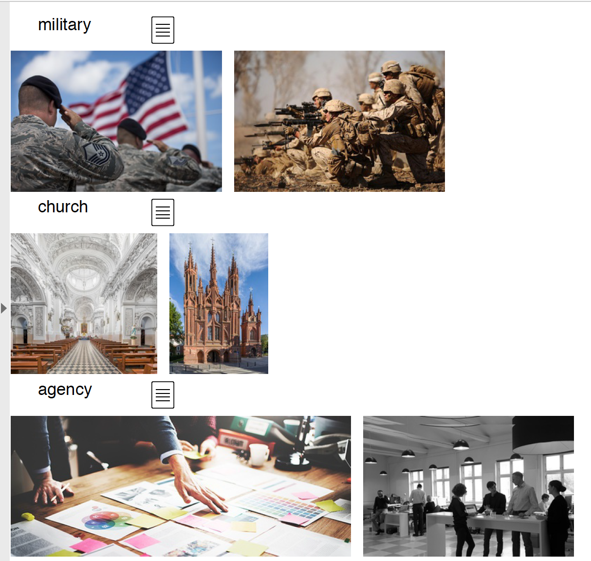

This project helps to memorize English words with referring images crawled
from google pictures. Input is the word list, the PDF will be generated
in the same folder.  
<br>
The input word list as:  

<br>
The output PDF as:  

<br>
<br>
Kick off as:
```shell
python crawlImage.py word_list
python transEngToCh.py word_list
python generatePDF.py word_list
```
