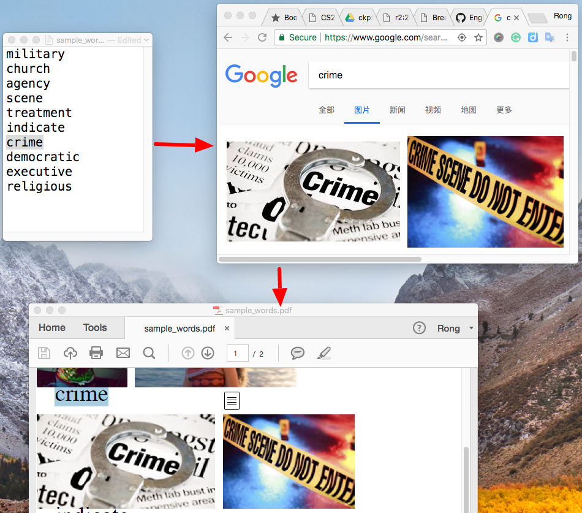

Given a sample word list (eg,```sample_words.txt```), the program will query each word and crawl top 2 images from Google and generate a nice PDF file (eg, ```sample_words.pdf```).
The purpose of this project is to help myself memory English words, because I feel easier to memory words with images incentive.

This project was developed on python2.

The pipeline is like:



additional requirements:  
```
pip2 install reportlab
pip2 install s4
pip2 install html5lib
```

kick off steps:  
```
python2 crawler.py sample_words.txt
python2 translator.py sample_words.txt
python2 writer.py sample_words.txt
```
